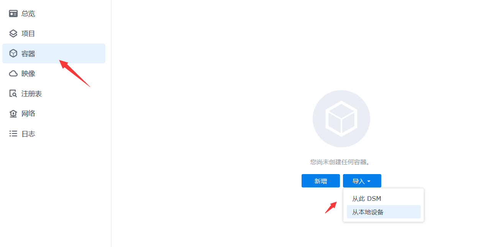

<div align="center">
  <a href="https://rustvnt.com"></a>
  <h1><p><em>VNT 一个简便高效的异地组网、内网穿透工具。</em></p></h1>
	<a href="https://github.com/vnt-dev/vnt/releases"></a>
  <a href="https://github.com/vnt-dev/vnt/graphs/contributors"></a>
  <a href="https://github.com/vnt-dev/vnt/releases/"></a>
  <a href="https://github.com/vnt-dev/vnt/issues"></a>
  <a href="https://github.com/vnt-dev/vnt/discussions"></a>
  <a href="GitHub repo size"></a>
  <a href="https://github.com/vnt-dev/vnt/actions?query=workflow%3ABuild"></a>
  <a href="https://hub.docker.com/r/lubeilin/vnt"></a>
</div>


# 群晖 Synology 篇 （以DSM 7.2 为例）

## [部署vnt-cli客户端](https://github.com/lmq8267/vnt/edit/main/docs/Synology.md#%E4%B8%80%E5%89%8D%E6%8F%90%E9%9C%80%E8%A6%81%E5%85%88%E7%A1%AE%E5%AE%9A%E5%B7%B2%E5%8A%A0%E8%BD%BD%E5%A5%BDtun%E6%A8%A1%E5%9D%97%E5%A6%82%E6%9E%9C%E6%B2%A1%E6%9C%89tun%E6%A8%A1%E5%9D%97%E7%9A%84%E5%88%99%E5%8F%AA%E8%83%BD%E4%BD%BF%E7%94%A8vn-link-cli)       [部署vnts服务端]()

### 一、前提需要先确定已加载好tun模块，如果没有tun模块的则只能使用vn-link-cli

#### ①启用群晖的ssh功能，打开ssh输入下述命令查看是否已加载好tun模块
```bash
#检查是否安装了 tun 模块：
lsmod | grep tun
#或者
ls /dev/net/tun
```

#### ②如上图输出信息则是youtun模块，
#### 如果没有输出，可执行下述命令加载，再使用上述命令检测是否加载成功
```bash
#如果上述结果为空，请尝试加载它：
sudo modprobe tun
#或者
sudo insmod /lib/modules/tun.ko
```


### Docker运行（有tun模块，使用特权模式）
#### 1.打开群晖管理页面，打开docker套件

#### 2.打开注册表搜索vnt，找到vnt镜像双击拉取

#### 如果拉取失败，点击[离线镜像包](https://github.com/lmq8267/vnt-cli/releases)下载对应平台架构docker的离线镜像包docker.tar上传安装


#### 3.打开


```bash
# docker

```

### 第三方套件运行

### ssh二进制运行
